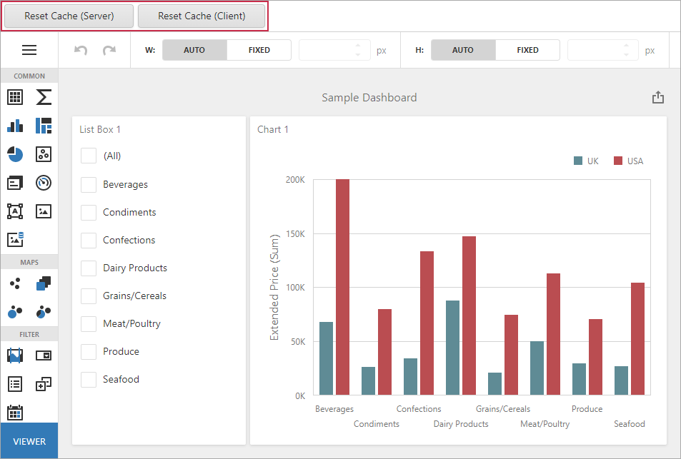

<!-- default badges list -->

<!-- default badges end -->

# Dashboard for MVC - How to Reset the Data Source Cache

The following example shows how you can manage the cache in the ASP.NET MVC Dashboard control.

To refresh the data source cache **on the server**, add a unique value to the [CustomData](http://docs.devexpress.com/Dashboard/DevExpress.DashboardCommon.IDataSourceCacheKey.CustomData) field in the [DashboardConfigurator.DataSourceCacheKeyCreated](http://docs.devexpress.com/Dashboard/DevExpress.DashboardWeb.DashboardConfigurator.DataSourceCacheKeyCreated) event handler. You can store the unique GUID value within a session as a parameter and update its value in your code when it is necessary to refresh the cache.

To refresh the data source cache **on the client**, you can call the [DashboardControl.reloadData](https://docs.devexpress.com/Dashboard/js-DevExpress.Dashboard.DashboardControl#js_DevExpress_Dashboard_DashboardControl_reloadData) client method.

- Click **Refresh Cache (Server)** to force the cache reset on the server.
- Click **Refresh Cache (Client)** to force the cache reset using the client API.

## Files to Review

* [Index.cshtml](/CS/MvcDashboardUseDifferentCaches/Views/Home/Index.cshtml) (VB: [Index.cshtml](/VB/MvcDashboardUseDifferentCaches/Views/Home/Index.cshtml))
* [HomeController.cs](/CS/MvcDashboardUseDifferentCaches/Controllers/HomeController.cs) (VB: [HomeController.vb](/VB/MvcDashboardUseDifferentCaches/Controllers/HomeController.vb))
* [DashboardConfig.cs](/CS/MvcDashboardUseDifferentCaches/App_Start/DashboardConfig.cs#L37) (VB: [DashboardConfig.vb](/VB/MvcDashboardUseDifferentCaches/App_Start/DashboardConfig.vb#L35))
* [CacheManager.cs](/CS/MvcDashboardUseDifferentCaches/CacheManager.cs) (VB: [CacheManager.vb](/VB/MvcDashboardUseDifferentCaches/CacheManager.vb))

## Documentation

* [Manage an In-Memory Data Cache](https://docs.devexpress.com/Dashboard/400983)

## More Examples

* [Dashboard for Web Forms - How to Reset the Data Source Cache](https://github.com/DevExpress-Examples/web-forms-dashboard-use-different-caches)
* [Dashboard for ASP.NET Core - How to Reset the Data Source Cache](https://github.com/DevExpress-Examples/aspnet-core-dashboard-use-different-caches)
